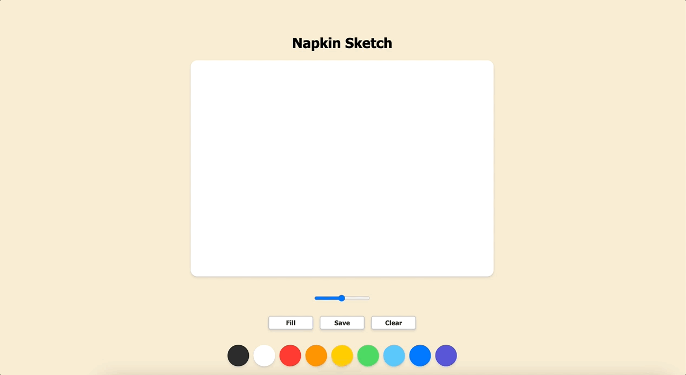

<h2 align="center">
  Napkin Sketch Board  
</h2>

<h3 align="center">
  From napkin to innovation: Sketch your dreams anytime, anywhere with our digital napkin sketch board!
</h3>

## Development Time ⏰
> **Computation:** 2024.04.25.

## Live Demo 🎬

> **Please click this link** :  

## Problem to solve 🎯

I developed this digital napkin sketch board with entrepreneurs in mind, recognizing the need for a portable solution to capture ideas on the fly. With this tool, I aim to empower fellow innovators to bring their visions to life anytime, anywhere, breaking free from the constraints of traditional pen and paper. I want to embrace limitless creativity and seizing every opportunity with their intuitive and convenient platform.  

## Tools 🛠️

### I used a simple tool kit

             

